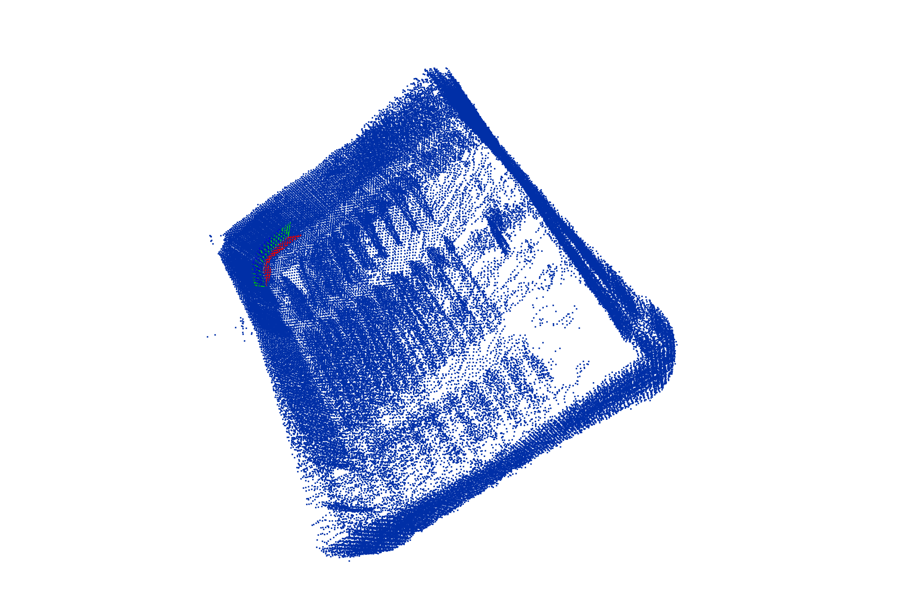

# HW1 

## Algorithm Overview

The algorithm backbone of my icp implementation is as follows:

```python
def icp(point_cloud_1, point_cloud_2):
    transform = init() # init to identity
    transform_ = transform.copy()
    
    for i in range(MAX_ITER):
        # update point cloud
        point_cloud_1 = update_point_cloud(point_cloud_1, transform)
        
        # find nearest neighbor
        corresponding_points, outlier_ratio = find_nearest_neighbor(
  					random_choose(point_cloud_1),
            point_cloud_2
        )

        # calculate transform
        transform = calculate_transform(corresponding_points)
        transform_ = transform @ transform_

    return transform_
```

The basic idea is that we firstly initialize the transform with identity (given that the movement between point clouds won't be too intense). And then, we predefine the maximum number of iterations, once we reach it and then we stop. For each iteration, it firstly updates the point clound 1 with the previous transform. Then it will find the nearest neighbor and caculate the new transformation based on that correspondence. It will aggregate the transform between iterations to get the overall transform.


## Details

#### find_nearest_neighbor

1. ##### Sampling

   As for each frame of point cloud, there are $131072$ points in it.  So the computational complexity of finding the nearest neighbors is $131072\times131072\sim10^{10}$. So it is too slow to find all the nearest neighbors. My strategy is sampling from point cloud 1 (about $1000$ samples), and keep all points in point clound 2. 

   The reason for this strategy is that, for the query (point cloud 1), the sparsity of sampling won't really impact the result of transform calculation (we can easily find a pretty good transform from the subset of 1000 points). But for the target (point cloud 2), sampling may result in cases that the matches in point cloud 2 cannot be found.

2. ##### Rejection

   I set RADIUS=0.2 to filter out all those matches that are larger than 0.2, trying to eliminate the effects from matching outliers.

   

#### calculate_transform

I use Arun's Algorithm to obtain the $R$ and $t$:

```Python
    Q = centered_point_cloud_2.T @ centered_point_cloud_1
    U, S, V = np.linalg.svd(Q)
    R = U @ V
    if np.linalg.det(R) < 0:
        R[:, 2] = -R[:, 2]
    t = mean2.reshape(3, 1) - R @ mean1.T
```

Note that It will flip the $R$ correctly if the det of $R$ is negative.


#### Miscellaneous

I also use multi-processing to parallelize the caclulation between frames: 

```python
    for i in range(1, num_frames): # i: 1, 2, ..., num_frames-1
        point_cloud_2 = np.loadtxt(frame_list[i])
        results.append(pool.apply_async(icp_process, args=(point_cloud_1, point_cloud_2, i-1)))
        point_cloud_1 = point_cloud_2
```


## Result

It successfully generates the aligned point clouds:




And here is the errors and outlier ratios:


