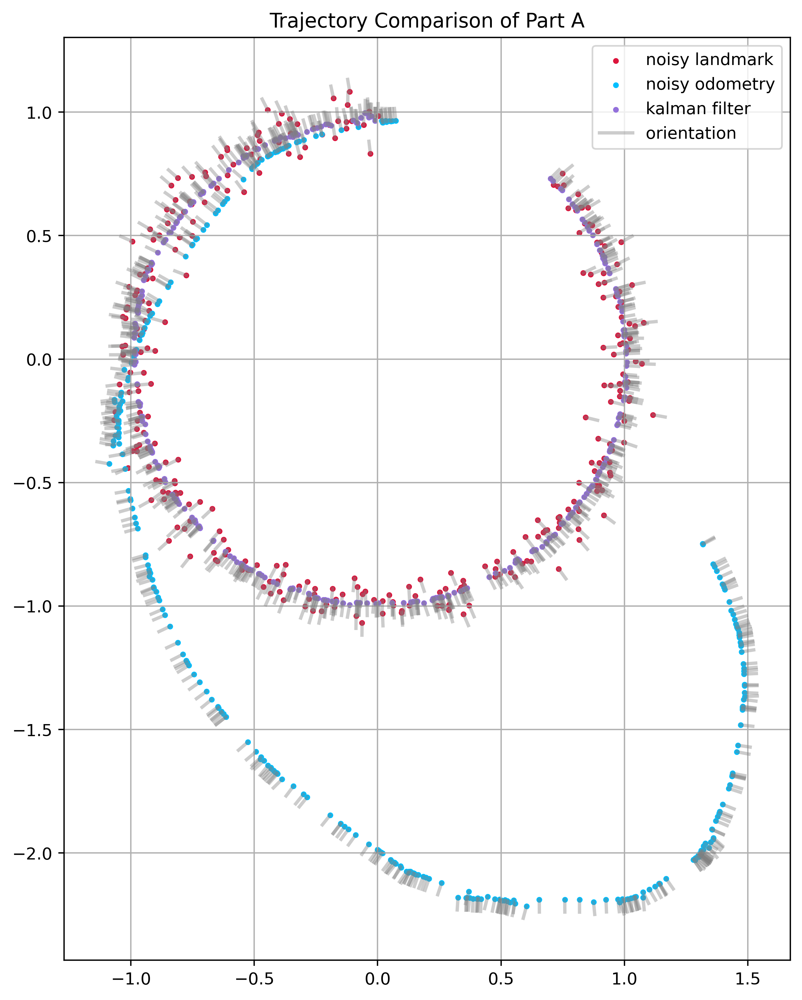
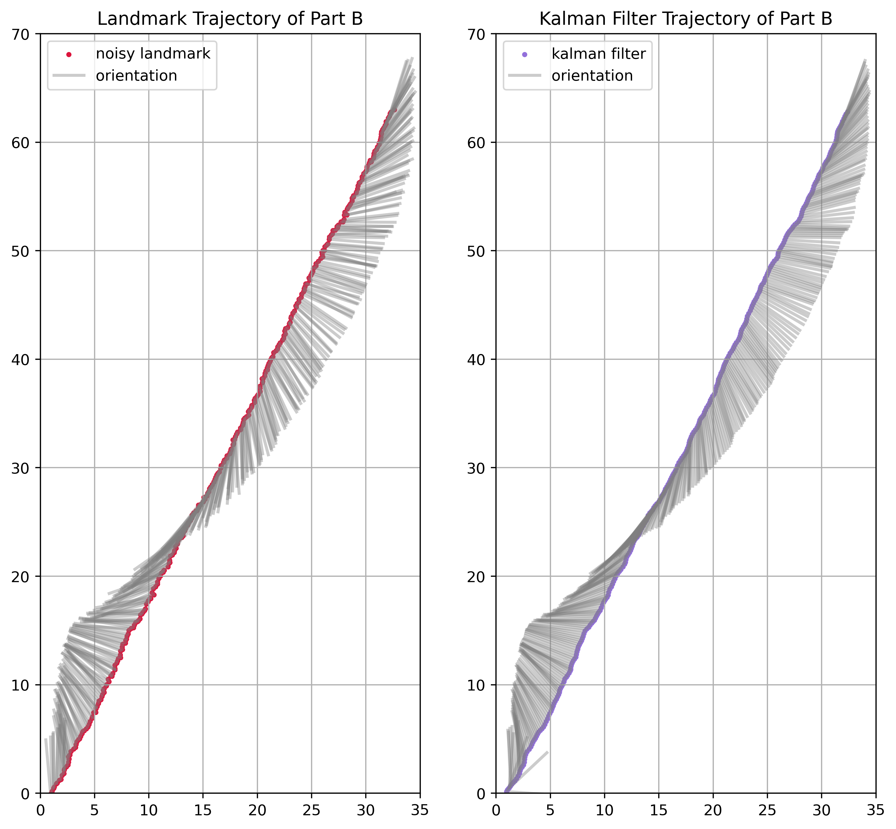

# HW2 Kalman filter 

## General Algorithm

#### Problem Formulation

$$x_k = f(x_{k-1}, u_k, w_k)$$

$$z_k = h(x_k, v_k)$$

Here $$w_k$$ and $$v_k$$ are the process and observation noises which are both assumed to be zero mean multivariate Gaussian noises with covariance $$Q_k$$ and $$R_k$$  respectively. $u_k$ is the control vector.

We define the Jacobian matrix: $$\displaystyle{F_k}=\left.{\frac {\partial f}{\partial {x}}}\right\vert _{{\hat {x}}_{k-1|k-1},{u}_{k}}$$,  $$\displaystyle{H_k}=\left.{\frac {\partial h}{\partial {x}}}\right\vert _{{\hat {x}}_{k-1|k-1}}$$, $$\displaystyle{L_{k}}=\left.{\frac {\partial f}{\partial {\omega}}}\right\vert _{{\hat {x}}_{k-1|k-1},{u}_{k}}$$ and $$\displaystyle{M_k}=\left.{\frac {\partial h}{\partial {v}}}\right\vert _{{\hat {x}}_{k|k-1}}$$

#### Predic

Predicted state estimate: $$\hat{x}_{k|k-1} = f(\hat{x}_{k-1|k-1}, u_k)$$

Predicted covariance estimate: $$P_{k|k-1} = F_kP_{k-1|k-1}F_k^T + L_{k}Q_kL_{k}^T$$

#### Update

Innovation or measurement residual: $$\tilde{y}_k = z_k - h(\hat{x}_{k|k-1})$$

Innovation (or residual) covariance: $$S_k = H_kP_{k|k-1}H_k^T+M_kR_kM_k^T$$

*Near-optimal* Kalman gain: $$K_k = P_{k|k-1}H_k^TS_k^{-1}$$

Updated state estimate: $$\hat{x}_{k|k} = \hat{x}_{k|k-1}+K_k\tilde{y}_k$$

Updated covariance estimate: $$P_{k|k} = (I-K_kH_k)P_{k|k-1}$$

## PartA

In this setting, we have (under noise-free notations):

$x_k = (\text{x}_k, \text{y}_k, \theta)$ at time $k$, $u_k = (\delta_1, \delta_t, \delta_2)$

$f(x_{k-1}, u_k)[0] = x_{k-1}[0] + u_k[1]\cdot\cos{(u[0] +x_{k-1}[2])}$

$f(x_{k-1}, u_k)[1] = x_{k-1}[1] + u_k[1]\cdot\sin{(u[0] +x_{k-1}[2])}$

$f(x_{k-1}, u_k)[2] = x_{k-1}[2] + u_k[1] + u_k[2]$

$h(x_k) = x_k$

And the Jacobians then would be:

$$F = \left(\begin{matrix}1&0&-u_k[1]\cdot\sin{(u[0] +x_{k-1}[2])}\\0&1&u_k[1]\cdot\cos{(u[0] +x_{k-1}[2])}\\0&0&1\end{matrix}\right)$$

$$H = I$$

$$L = \left(\begin{matrix}-u_k[1]\cdot\sin{(u[0] +x_{k-1}[2])}&\cos{(u[0] +x_{k-1}[2])}&0\\u_k[1]\cdot\cos{(u[0] +x_{k-1}[2])}&\sin{(u[0] +x_{k-1}[2])}&0\\1&0&1\end{matrix}\right)$$

$M = I$

$$Q = \left(\begin{matrix}0.02^2&0&0\\0&0.05^2&0\\0&0&0.02^2\end{matrix}\right)$$

$R = \left(\begin{matrix}0.05^2&0&0\\0&0.05^2&0\\0&0&0.03^2\end{matrix}\right)$

Initialize $P$ with $R$,

Run the EKF algorithm, we got the result as follows:

We can see that my algorithm converges to a smooth Standard-shaped circle.

## PartB

In this setting, we have (under noise-free notations):

$x_k = (\text{x}_k, \text{y}_k, \theta, v_x, v_y, \omega)$ at time $k$,

$f(x_{k-1})[0] = x_{k-1}[0] + x_{k-1}[3]$

$f(x_{k-1})[1] = x_{k-1}[1] + x_{k-1}[4]$

$f(x_{k-1})[2] = x_{k-1}[2] + x_{k-1}[3]$

$f(x_{k-1})[3] = x_{k-1}[3]$

$f(x_{k-1})[4] = x_{k-1}[4]$

$f(x_{k-1})[5] = x_{k-1}[5]$

$h(x_{k-1})[0] = x_{k-1}[0] + x_{k-1}[3]$

$h(x_{k-1})[1] = x_{k-1}[1] + x_{k-1}[4]$

$h(x_{k-1})[2] = x_{k-1}[2] + x_{k-1}[3]$

And the Jacobians then would be:

$$F = \left(\begin{matrix}1&0&0&1&0&0\\0&1&0&0&1&0\\0&0&1&0&0&1\\0&0&0&1&0&0\\0&0&0&0&1&0\\0&0&0&0&0&1\end{matrix}\right)$$

$$H = \left(\begin{matrix}1&0&0&1&0&0\\0&1&0&0&1&0\\0&0&1&0&0&1\end{matrix}\right)$$

$$L = I$$

$M = I$

$$Q = \left(\begin{matrix}0&0&0&0&0&0\\0&0&0&0&0&0\\0&0&0&0&0&0\\0&0&0&0.05^2&0&0\\0&0&0&0&0.05^2&0\\0&0&0&0&0&0.02^2\end{matrix}\right)$$

$R = \left(\begin{matrix}0.05^2&0&0\\0&0.05^2&0\\0&0&0.05^2\end{matrix}\right)$

Initialize $P$ with $R$ and $Q$,

Run the EKF algorithm, we got the result as follows:

We can see that my algorithm converges to a smooth trajectory.

And we can see the velocity:

As we can see, KF canceled most of the observation noise and tried to maintain the original variety of velocity at the same time. 
